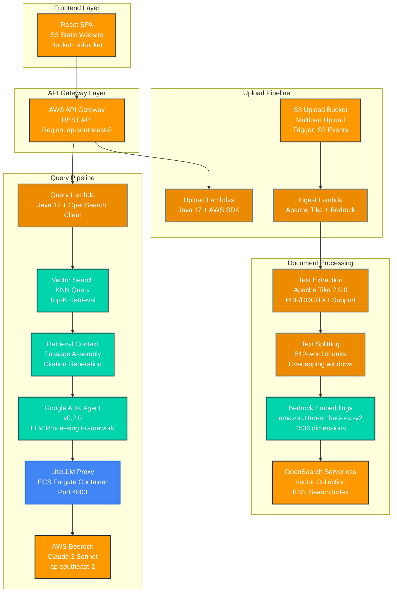
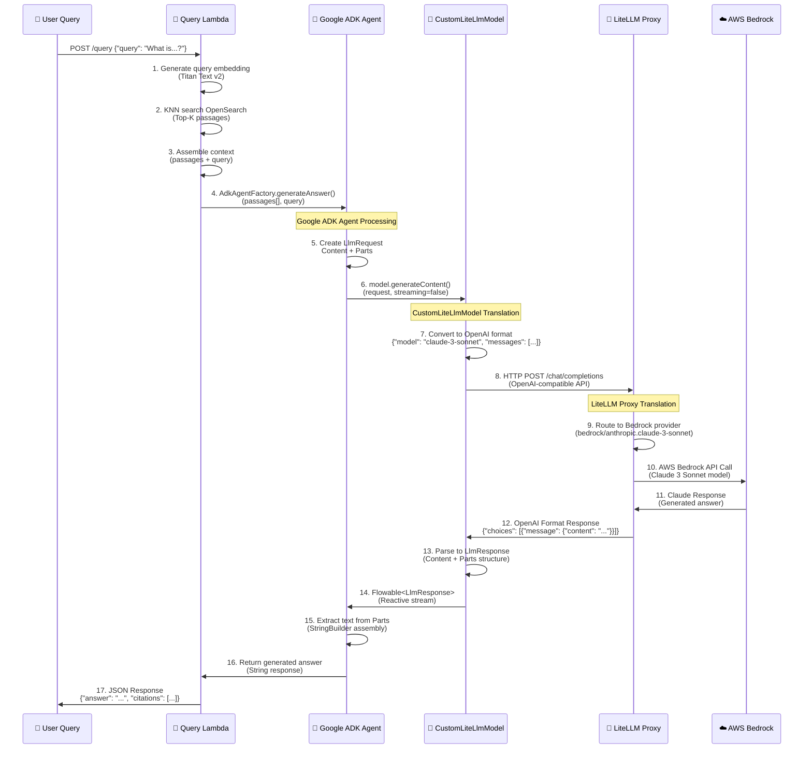

# RAG Document Q&A Agent

A modern Retrieval-Augmented Generation (RAG) system for document question-answering, built with Java 17, Google ADK, AWS Bedrock Claude 3 Sonnet, and deployed on AWS using Terraform.

## 🏗️ System Architecture



## 🔄 Google ADK to Bedrock Communication Flow

This section explains the detailed communication flow between Google ADK and AWS Bedrock through the LiteLLM proxy.

### Communication Architecture



### Technical Implementation Details

#### 1. **Google ADK Integration** (`AdkAgentFactory.java`)

```java
public static String generateAnswer(List<String> passages, String query) {
    // Create LLM request with context
    Part textPart = Part.builder().text(context.toString()).build();
    Content userContent = Content.builder().parts(List.of(textPart)).build();
    LlmRequest request = LlmRequest.builder().contents(List.of(userContent)).build();
    
    // Use custom model for generation
    CustomLiteLlmModel model = new CustomLiteLlmModel();
    Flowable<LlmResponse> responseFlow = model.generateContent(request, false);
    
    // Block and extract response with timeout
    LlmResponse response = responseFlow.timeout(30, TimeUnit.SECONDS).blockingFirst();
    // Extract text from response parts...
}
```

#### 2. **LiteLLM Model Bridge** (`CustomLiteLlmModel.java`)

```java
@Override
public Flowable<LlmResponse> generateContent(LlmRequest request, boolean streaming) {
    return Flowable.fromCallable(() -> {
        // Convert ADK request to OpenAI format
        ObjectNode requestBody = createOpenAiRequest(request);
        
        // HTTP call to LiteLLM proxy
        Request httpRequest = new Request.Builder()
            .url(litellmEndpoint + "/chat/completions")
            .post(RequestBody.create(JsonUtil.toJson(requestBody), MediaType.get("application/json")))
            .build();
        
        // Parse response back to ADK format
        return parseOpenAiResponse(responseJson);
    });
}
```

#### 3. **LiteLLM Configuration** (ECS Container)

```yaml
# LiteLLM Config (S3: litellm-config-bucket/config.yaml)
model_list:
  - model_name: anthropic.claude-3-sonnet-20240229-v1:0
    litellm_params:
      model: bedrock/anthropic.claude-3-sonnet-20240229-v1:0
      aws_region_name: ap-southeast-2
```

#### 4. **Data Flow Transformations**

| Stage | Input Format | Output Format | Component |
|-------|-------------|---------------|-----------|
| **User Query** | `{"query": "string"}` | `RetrievalResult[]` | Query Lambda |
| **Context Assembly** | `RetrievalResult[]` | `String context` | AdkAgentFactory |
| **ADK Request** | `String context` | `LlmRequest` | Google ADK |
| **Model Translation** | `LlmRequest` | `OpenAI JSON` | CustomLiteLlmModel |
| **Proxy Routing** | `OpenAI JSON` | `Bedrock API` | LiteLLM Proxy |
| **Model Response** | `Claude JSON` | `OpenAI JSON` | LiteLLM Proxy |
| **ADK Response** | `OpenAI JSON` | `LlmResponse` | CustomLiteLlmModel |
| **Final Answer** | `LlmResponse` | `String answer` | AdkAgentFactory |

## 🎛️ Control Flow Diagram

```mermaid
flowchart TD
    Start([🚀 User Submits Query]) --> Validate{📝 Validate Input}
    Validate -->|❌ Invalid| ErrorResponse[🚨 Return Error Response]
    Validate -->|✅ Valid| EmbedQuery[🔤 Generate Query Embedding<br/>Bedrock Titan Text v2]
    
    EmbedQuery --> VectorSearch[🔍 Vector Search<br/>OpenSearch KNN Query<br/>Top-K Retrieval]
    VectorSearch --> CheckResults{📊 Results Found?}
    CheckResults -->|❌ No Results| NoResults[📭 Return "No relevant documents"]
    
    CheckResults -->|✅ Has Results| AssembleContext[📋 Assemble Context<br/>Format: "Context excerpts:\n\nExcerpt 1:\n{text1}\n\n..."]
    
    AssembleContext --> CreateADKRequest[🤖 Create Google ADK Request<br/>LlmRequest.builder()<br/>.contents(List.of(userContent))]
    
    CreateADKRequest --> ModelGeneration[🧠 Model Generation<br/>CustomLiteLlmModel.generateContent()]
    
    ModelGeneration --> ConvertToOpenAI[🔄 Convert to OpenAI Format<br/>{"model": "claude-3-sonnet",<br/>"messages": [{"role": "user", "content": "..."}]}]
    
    ConvertToOpenAI --> LiteLLMCall[🌐 HTTP POST to LiteLLM<br/>{LITELLM_ENDPOINT}/chat/completions]
    
    LiteLLMCall --> LiteLLMRouting[🔀 LiteLLM Routes to Bedrock<br/>Provider: bedrock/anthropic.claude-3-sonnet<br/>Region: ap-southeast-2]
    
    LiteLLMRouting --> BedrockAPI[☁️ AWS Bedrock API Call<br/>InvokeModel(claude-3-sonnet)<br/>Max Tokens: 4096, Temperature: 0.1]
    
    BedrockAPI --> ClaudeResponse[🤖 Claude 3 Sonnet Response<br/>Generated Answer Text]
    
    ClaudeResponse --> ProxyResponse[🔄 LiteLLM OpenAI Response<br/>{"choices": [{"message": {"content": "..."}}]}]
    
    ProxyResponse --> ParseADKResponse[📝 Parse to ADK LlmResponse<br/>Content.builder().parts(List.of(textPart))]
    
    ParseADKResponse --> ExtractText[📖 Extract Text from Parts<br/>StringBuilder.append(part.text())]
    
    ExtractText --> FormatResponse[📋 Format Final Response<br/>{"answer": "...", "citations": [...], "usedPassages": [...]}]
    
    FormatResponse --> Success([✅ Return Success Response])
    
    %% Error Handling
    EmbedQuery -->|❌ Error| EmbedError[🚨 Embedding Generation Failed]
    VectorSearch -->|❌ Error| SearchError[🚨 Vector Search Failed]  
    ModelGeneration -->|❌ Error| ModelError[🚨 Model Generation Failed]
    LiteLLMCall -->|❌ Error| ProxyError[🚨 LiteLLM Proxy Error]
    BedrockAPI -->|❌ Error| BedrockError[🚨 Bedrock API Error]
    
    EmbedError --> ErrorResponse
    SearchError --> ErrorResponse
    ModelError --> ErrorResponse
    ProxyError --> ErrorResponse
    BedrockError --> ErrorResponse
    
    %% Styling
    classDef startEnd fill:#e1f5fe,stroke:#0277bd,stroke-width:3px
    classDef process fill:#f3e5f5,stroke:#7b1fa2,stroke-width:2px
    classDef decision fill:#fff3e0,stroke:#ef6c00,stroke-width:2px
    classDef error fill:#ffebee,stroke:#c62828,stroke-width:2px
    classDef external fill:#e8f5e8,stroke:#2e7d32,stroke-width:2px
    
    class Start,Success startEnd
    class EmbedQuery,VectorSearch,AssembleContext,CreateADKRequest,ModelGeneration,ConvertToOpenAI,ParseADKResponse,ExtractText,FormatResponse process
    class Validate,CheckResults decision
    class ErrorResponse,EmbedError,SearchError,ModelError,ProxyError,BedrockError,NoResults error
    class LiteLLMCall,LiteLLMRouting,BedrockAPI,ClaudeResponse,ProxyResponse external
```

## 🏗️ Infrastructure Architecture

```mermaid
graph TB
    subgraph "AWS Region: ap-southeast-2 (Sydney)"
        subgraph "VPC: rag-agent-dev-vpc (10.0.0.0/16)"
            subgraph "Public Subnets (2 AZs)"
                ALB[Application Load Balancer<br/>Internet-facing<br/>Port 80 → 4000]
                NAT1[NAT Gateway 1<br/>10.0.1.0/24]
                NAT2[NAT Gateway 2<br/>10.0.2.0/24]
            end
            
            subgraph "Private Subnets (2 AZs)"
                ECS[ECS Fargate Service<br/>LiteLLM Container<br/>CPU: 512, Memory: 1024]
                LAMBDA[Lambda Functions<br/>VPC-enabled<br/>Java 17 Runtime]
            end
        end
        
        subgraph "Serverless Services"
            S3UI[S3 Bucket: UI<br/>Static Website<br/>Public Read]
            S3UP[S3 Bucket: Uploads<br/>Multipart Upload<br/>Event Notifications]
            S3CFG[S3 Bucket: LiteLLM Config<br/>config.yaml<br/>Private Access]
            
            APIGW[API Gateway<br/>REST API<br/>CORS Enabled]
            
            OSS[OpenSearch Serverless<br/>Vector Collection<br/>Index: documents<br/>Dimension: 1536]
            
            BEDROCK[AWS Bedrock<br/>Models:<br/>• amazon.titan-embed-text-v2<br/>• anthropic.claude-3-sonnet-20240229-v1:0]
        end
        
        subgraph "IAM Roles & Policies"
            ROLE1[Lambda Upload Role<br/>• S3 Multipart Operations<br/>• CloudWatch Logs]
            ROLE2[Lambda Ingest Role<br/>• S3 GetObject<br/>• Bedrock InvokeModel<br/>• OpenSearch Write]
            ROLE3[Lambda Query Role<br/>• Bedrock InvokeModel<br/>• OpenSearch Read]
            ROLE4[ECS Task Role<br/>• S3 Config Read<br/>• Bedrock InvokeModel]
        end
    end
    
    %% Connections
    Internet([🌐 Internet]) --> ALB
    ALB --> ECS
    ECS --> S3CFG
    ECS --> BEDROCK
    
    Internet --> S3UI
    Internet --> APIGW
    APIGW --> LAMBDA
    
    LAMBDA --> S3UP
    LAMBDA --> OSS  
    LAMBDA --> BEDROCK
    LAMBDA --> ECS
    
    S3UP -.->|S3 Events| LAMBDA
    
    %% Styling
    classDef aws fill:#ff9900,stroke:#232f3e,stroke-width:2px,color:#fff
    classDef networking fill:#4285f4,stroke:#1a73e8,stroke-width:2px,color:#fff
    classDef security fill:#ea4335,stroke:#d93025,stroke-width:2px,color:#fff
    classDef serverless fill:#00d4aa,stroke:#00acc1,stroke-width:2px,color:#fff
    
    class S3UI,S3UP,S3CFG,APIGW,OSS,BEDROCK aws
    class ALB,NAT1,NAT2,ECS,LAMBDA networking  
    class ROLE1,ROLE2,ROLE3,ROLE4 security
    class OSS,BEDROCK,APIGW serverless
```

## 📋 System Components

### Core Architecture Responsibilities

1. **📤 Upload Component**: Handles multipart file uploads to S3 via pre-signed URLs
2. **⚙️ Ingestion Pipeline**: Processes documents, extracts text, creates embeddings, and indexes to OpenSearch
3. **🔍 Retrieval System**: Searches for relevant document chunks using vector similarity (KNN)
4. **🤖 LLM Agent**: Uses Google ADK with LiteLLM proxy to generate answers from retrieved passages

### Technology Stack

| Component | Technology | Version | Purpose |
|-----------|------------|---------|---------|
| **Runtime** | Java | 17 | Lambda functions, high performance |
| **Build Tool** | Maven | 3.8+ | Dependency management, packaging |
| **AI Framework** | Google ADK | 0.2.0 | LLM agent orchestration |
| **LLM Model** | Claude 3 Sonnet | v1:0 | Text generation, reasoning |
| **Embeddings** | Titan Text | v2 | Vector embeddings (1536 dim) |
| **Vector DB** | OpenSearch Serverless | 2.6+ | KNN search, auto-scaling |
| **Text Extraction** | Apache Tika | 2.9.0 | PDF, DOC, TXT processing |
| **HTTP Client** | OkHttp | 4.12.0 | LiteLLM proxy communication |
| **Infrastructure** | Terraform | 1.0+ | AWS resource management |
| **Container** | LiteLLM | latest | Multi-provider LLM proxy |

## 🔌 API Specification

### Upload Endpoints

#### POST /upload/initiate
Initiates a multipart upload for a document.

**Request:**
```json
{
  "fileName": "document.pdf",
  "contentType": "application/pdf"
}
```

**Response:**
```json
{
  "uploadId": "abc123...",
  "key": "uuid/document.pdf",
  "bucket": "rag-agent-dev-uploads-xyz"
}
```

#### GET /upload/presignPart
Gets a pre-signed URL for uploading a file part.

**Query Parameters:**
- `bucket`: S3 bucket name
- `key`: Object key
- `uploadId`: Upload ID from initiate
- `partNumber`: Part number (1-based)

**Response:**
```json
{
  "presignedUrl": "https://s3.ap-southeast-2.amazonaws.com/...",
  "partNumber": 1
}
```

#### POST /upload/complete
Completes the multipart upload.

**Request:**
```json
{
  "bucket": "rag-agent-dev-uploads-xyz",
  "key": "uuid/document.pdf", 
  "uploadId": "abc123...",
  "parts": [
    {
      "PartNumber": 1,
      "ETag": "\"etag1\""
    }
  ]
}
```

**Response:**
```json
{
  "location": "https://s3.ap-southeast-2.amazonaws.com/bucket/key",
  "bucket": "rag-agent-dev-uploads-xyz",
  "key": "uuid/document.pdf",
  "etag": "\"final-etag\""
}
```

### Query Endpoint

#### POST /query
Asks a question about uploaded documents.

**Request:**
```json
{
  "query": "What is the main topic of the documents?"
}
```

**Response:**
```json
{
  "answer": "Based on the provided excerpts, the main topic discusses cloud computing architectures and their implementation patterns...",
  "citations": [
    {
      "id": "chunk-id-1",
      "score": 0.95
    }
  ],
  "usedPassages": [
    "This excerpt from page 15 discusses cloud architectures..."
  ]
}
```

## 🚀 Deployment Instructions

### Prerequisites

1. **☁️ AWS CLI configured** with appropriate permissions for:
   - Lambda, API Gateway, S3, OpenSearch Serverless
   - Bedrock model access (Claude 3 Sonnet, Titan Text)
   - IAM role creation and management
   - VPC and networking resources

2. **🏗️ Terraform** >= 1.0 installed and configured

3. **☕ Java Development Kit** 17+ and Maven 3.8+ installed

4. **🤖 Access to AWS Bedrock** with models enabled:
   - `anthropic.claude-3-sonnet-20240229-v1:0` 
   - `amazon.titan-embed-text-v2`

### Step 1: Build Java Components

```bash
# Build the Maven project with all dependencies
mvn clean compile package -DskipTests

# Verify the shaded JAR was created (should be ~43MB)
ls -lh target/rag-agent-1.0.0.jar

# Output: -rw-r--r-- 1 user staff 43M date time rag-agent-1.0.0.jar
```

### Step 2: Deploy AWS Infrastructure

```bash
# Navigate to terraform directory
cd terraform

# Initialize Terraform with required providers
terraform init

# Validate configuration
terraform validate

# Review the deployment plan (creates ~50+ resources)
terraform plan

# Deploy the infrastructure to ap-southeast-2 (Sydney)
terraform apply

# Note: Deployment takes ~15-20 minutes due to:
# - OpenSearch Serverless collection creation
# - ECS service startup and health checks
# - API Gateway deployment propagation
```

### Step 3: Access the Application

```bash
# Get the website URL
WEBSITE_URL=$(terraform output -raw ui_bucket_website_endpoint)
echo "🌐 Application URL: http://$WEBSITE_URL"

# Get the API Gateway endpoint
API_URL=$(terraform output -raw api_gateway_url)
echo "🔌 API Endpoint: $API_URL"

# Get LiteLLM proxy endpoint (for debugging)
LITELLM_URL=$(terraform output -raw litellm_endpoint)
echo "🤖 LiteLLM Proxy: $LITELLM_URL"
```

### Step 4: Verify Deployment

```bash
# Test the API Gateway health
curl "$API_URL/query" \
  -H "Content-Type: application/json" \
  -d '{"query": "test"}' \
  -v

# Check LiteLLM proxy health
curl "$LITELLM_URL/health"

# Expected response: {"status": "healthy"}
```

## 🧪 Testing

### Running Java Unit Tests

```bash
# Run all unit tests
mvn test

# Run with detailed output
mvn test -Dtest="*Test"

# Run specific test class
mvn test -Dtest="AdkAgentFactoryTest"

# Generate test coverage report
mvn test jacoco:report
# View at: target/site/jacoco/index.html
```

### Testing Infrastructure

```bash
# Validate Terraform configuration
terraform validate

# Plan without applying changes
terraform plan -detailed-exitcode

# Run Terraform tests (if available)
terraform test
```

### End-to-End Testing

```bash
# 1. Upload a test document
curl -X POST "$API_URL/upload/initiate" \
  -H "Content-Type: application/json" \
  -d '{"fileName": "test.txt", "contentType": "text/plain"}'

# 2. Complete upload process (use presigned URLs)

# 3. Wait for processing (check CloudWatch logs)

# 4. Query the document
curl -X POST "$API_URL/query" \
  -H "Content-Type: application/json" \
  -d '{"query": "What does the document discuss?"}' \
  | jq '.'
```

## ⚙️ Configuration

### Environment Variables (Lambda Functions)

| Variable | Purpose | Default | Example |
|----------|---------|---------|---------|
| `AWS_REGION` | AWS region for all services | `ap-southeast-2` | `ap-southeast-2` |
| `UPLOAD_BUCKET` | S3 bucket for file uploads | (terraform output) | `rag-agent-dev-uploads-xyz` |
| `OPENSEARCH_ENDPOINT` | OpenSearch Serverless endpoint | (terraform output) | `abc123.ap-southeast-2.aoss.amazonaws.com` |
| `OPENSEARCH_INDEX` | Index name for documents | `documents` | `documents` |
| `RETRIEVAL_TOP_K` | Number of chunks to retrieve | `5` | `5` |
| `LITELLM_ENDPOINT` | LiteLLM proxy endpoint | (terraform output) | `http://alb-dns-name` |

### Terraform Variables

Create `terraform.tfvars` file:

```hcl
# Basic Configuration
region                     = "ap-southeast-2"  # Sydney region for Bedrock
project_name               = "rag-agent"
environment                = "dev"

# OpenSearch Configuration  
opensearch_vector_dimension = 1536              # Titan Text v2 dimensions
retrieval_top_k            = 5                  # Top-K retrieval results

# ECS Configuration
ecs_task_cpu              = 512                 # 0.5 vCPU
ecs_task_memory           = 1024                # 1 GB RAM
ecs_desired_count         = 1                   # Single container

# Lambda Configuration
lambda_memory_size        = 512                 # MB per Lambda
lambda_timeout            = 300                 # 5 minutes max

# LiteLLM Configuration
litellm_config = <<-EOF
model_list:
  - model_name: anthropic.claude-3-sonnet-20240229-v1:0
    litellm_params:
      model: bedrock/anthropic.claude-3-sonnet-20240229-v1:0
      aws_region_name: ap-southeast-2
      max_tokens: 4096
      temperature: 0.1
EOF
```

## 🔒 Security & Operations

### IAM Permissions Matrix

| Role | S3 | Bedrock | OpenSearch | VPC | CloudWatch |
|------|----|---------|-----------|----|------------|
| **Lambda Upload** | ✅ Multipart ops | ❌ | ❌ | ✅ Access | ✅ Logs |
| **Lambda Ingest** | ✅ GetObject | ✅ Titan Embed | ✅ Write | ✅ Access | ✅ Logs |
| **Lambda Query** | ❌ | ✅ Titan Embed | ✅ Read | ✅ Access | ✅ Logs |
| **ECS Task** | ✅ Config Read | ✅ Claude Model | ❌ | ✅ Access | ✅ Logs |

### Security Features

- 🔐 **VPC Isolation**: All compute resources in private subnets
- 🛡️ **Security Groups**: Minimal required access (port 4000 for ECS)
- 🔑 **IAM Least Privilege**: Function-specific permissions only  
- 📦 **S3 Security**: Private buckets with specific access policies
- 🔍 **OpenSearch Access**: Fine-grained resource-based policies
- 🌐 **CORS Configuration**: Secure browser access patterns

### Monitoring & Observability

```bash
# CloudWatch Log Groups Created:
# - /aws/lambda/rag-agent-dev-upload-initiate
# - /aws/lambda/rag-agent-dev-upload-presign-part  
# - /aws/lambda/rag-agent-dev-upload-complete
# - /aws/lambda/rag-agent-dev-ingest
# - /aws/lambda/rag-agent-dev-query
# - /ecs/rag-agent-dev-litellm

# View recent logs
aws logs tail /aws/lambda/rag-agent-dev-query --follow --since 1h

# Check ECS service health
aws ecs describe-services \
  --cluster rag-agent-dev-cluster \
  --services rag-agent-dev-litellm \
  --query 'services[0].{Status:status,Running:runningCount,Desired:desiredCount}'

# Monitor OpenSearch collection
aws opensearchserverless list-collections \
  --collection-filters 'name=rag-agent-dev-documents'
```

### Cost Optimization

| Service | Optimization | Monthly Cost Estimate |
|---------|--------------|---------------------|
| **Lambda** | Pay-per-invocation | $5-20 (1000 queries) |
| **OpenSearch Serverless** | Auto-scaling OCUs | $50-200 (depends on data) |  
| **ECS Fargate** | Right-sized containers | $25-50 (512 CPU/1GB) |
| **S3** | Intelligent Tiering | $5-15 (10GB storage) |
| **API Gateway** | Pay-per-request | $3-10 (1M requests) |
| **Bedrock** | Pay-per-token | $10-50 (varies by usage) |
| **Total Estimated** | | **$98-345/month** |

## 🛠️ Troubleshooting

### Common Issues & Solutions

#### 1. 🤖 Google ADK Integration Issues

**Error:** `Could not resolve com.google.adk:google-adk:0.2.0`

**Root Cause:** Maven cannot resolve Google ADK dependency

**Solution:** 
```bash
# Verify Maven settings and repository access
mvn dependency:tree | grep google-adk

# Force re-download dependencies
mvn clean compile -U

# ❌ DO NOT: Mock, comment out, or substitute ADK with other frameworks
# ✅ DO: Ensure proper Maven central access and ADK version
```

#### 2. 🔗 LiteLLM Proxy Connection Issues

**Error:** `Connection refused` or `HTTP 503 Service Unavailable`

**Diagnosis:**
```bash
# Check ECS service status
aws ecs describe-services --cluster rag-agent-dev-cluster --services rag-agent-dev-litellm

# Check ALB target health
aws elbv2 describe-target-health --target-group-arn <target-group-arn>

# View container logs
aws logs tail /ecs/rag-agent-dev-litellm --follow
```

**Solutions:**
- ✅ Verify S3 config file exists and is valid YAML
- ✅ Check ECS task has proper Bedrock permissions
- ✅ Ensure container health check passes (`/health` endpoint)
- ✅ Validate ALB security group allows inbound port 80

#### 3. 🔍 OpenSearch Connection Issues

**Error:** `AccessDeniedError` or `Connection timeout`

**Diagnosis:**
```bash
# Check collection status
aws opensearchserverless get-collection --id <collection-id>

# Verify access policies
aws opensearchserverless list-access-policies --type data
```

**Solutions:**
- ✅ Ensure Lambda execution roles are in access policy principals
- ✅ Verify security groups allow outbound HTTPS (443)
- ✅ Check OpenSearch collection is in `ACTIVE` state
- ✅ Validate index mapping exists for vector field

#### 4. 🔤 Bedrock Access Issues  

**Error:** `AccessDeniedError` or `ValidationException`

**Solutions:**
```bash
# Check Bedrock model access
aws bedrock list-foundation-models --region ap-southeast-2

# Verify IAM permissions for specific models
aws iam get-role-policy --role-name rag-agent-dev-lambda-query-role --policy-name query-policy
```

- ✅ Ensure Claude 3 Sonnet and Titan Text models are enabled
- ✅ Verify region is `ap-southeast-2` (Sydney)  
- ✅ Check IAM policies have correct model ARNs

#### 5. 📦 Maven Build Issues

**Error:** `Compilation failure` or `Unused declared dependencies`

**Solutions:**
```bash
# Clean build with dependency resolution
mvn clean compile -U -X

# Analyze dependencies  
mvn dependency:analyze

# Run with lint warnings enabled
mvn compile -Dmaven.compiler.showWarnings=true
```

- ✅ Use Java 17 as specified in pom.xml
- ✅ Don't remove Google ADK or core dependencies
- ✅ Address unused import warnings only

### Performance Tuning

#### Lambda Optimization
```bash
# Increase memory for faster execution (more CPU allocated)
# Edit terraform/variables.tf:
lambda_memory_size = 1024  # Instead of 512MB

# Enable provisioned concurrency for frequently called functions
# Add to terraform/lambda.tf:
provisioned_concurrency_config {
  provisioned_concurrent_executions = 2
}
```

#### OpenSearch Query Performance
```hcl
# Adjust retrieval parameters in terraform/variables.tf:
retrieval_top_k = 3           # Reduce for faster queries  
opensearch_vector_dimension = 768  # Use smaller embeddings if accuracy allows
```

#### Upload Performance  
```javascript
// Increase chunk size for better upload performance
// Edit ui/app.js:
const CHUNK_SIZE = 10 * 1024 * 1024;  // 10MB instead of 5MB
```

### Monitoring Commands

```bash
# Real-time Lambda monitoring
aws logs tail /aws/lambda/rag-agent-dev-query --follow \
  --filter-pattern "ERROR" \
  --since 5m

# ECS service metrics  
aws cloudwatch get-metric-statistics \
  --namespace AWS/ECS \
  --metric-name CPUUtilization \
  --dimensions Name=ServiceName,Value=rag-agent-dev-litellm \
  --start-time $(date -u -d '1 hour ago' +%Y-%m-%dT%H:%M:%S) \
  --end-time $(date -u +%Y-%m-%dT%H:%M:%S) \
  --period 300 \
  --statistics Average

# API Gateway performance
aws apigateway get-usage \
  --usage-plan-id <plan-id> \
  --key-id <api-key> \
  --start-date $(date -u -d '1 day ago' +%Y-%m-%d) \
  --end-date $(date -u +%Y-%m-%d)
```

## 🔧 Development Notes

### Framework Constraints

⚠️ **Critical Implementation Requirements** - These **MUST NOT** be changed:

- ✅ **Google ADK v0.2.0** for LLM agent functionality (not LangChain, not custom implementations)
- ✅ **AWS Bedrock Claude 3 Sonnet** via LiteLLM proxy for model inference  
- ✅ **OpenSearch Serverless** for vector storage (not Pinecone, not Weaviate)
- ✅ **Terraform only** for infrastructure (no CDK, no CloudFormation)
- ✅ **Java 17** runtime for all Lambda functions
- ✅ **Apache Tika 2.9.0** for text extraction

### Code Structure

```
📁 rag-agent/
├── 📁 src/main/java/com/rag/agent/
│   ├── 🤖 agent/              # Google ADK integration
│   │   ├── AdkAgentFactory.java      # Main agent orchestration  
│   │   └── CustomLiteLlmModel.java   # LiteLLM proxy bridge
│   ├── ⚙️ ingest/            # Document processing pipeline  
│   │   ├── IngestS3Handler.java      # S3 event processing
│   │   ├── EmbeddingsClient.java     # Bedrock embeddings
│   │   └── OpenSearchClientProvider.java  # OpenSearch connection
│   ├── 📤 upload/            # S3 multipart upload handlers
│   │   ├── UploadInitiateFunction.java
│   │   ├── UploadPresignPartFunction.java  
│   │   └── UploadCompleteFunction.java
│   ├── 🔍 query/             # RAG query processing
│   │   ├── QueryHandler.java         # Main query endpoint
│   │   └── RetrievalClient.java      # Vector search logic
│   └── 🛠️ util/             # Shared utilities
│       ├── Env.java                  # Environment variables
│       ├── JsonUtil.java             # JSON processing
│       └── TextExtractor.java        # Document text extraction
├── 📁 terraform/             # Infrastructure as Code
│   ├── main.tf                       # Provider configuration
│   ├── variables.tf                  # Input variables  
│   ├── outputs.tf                    # Output values
│   ├── vpc.tf                        # VPC and networking
│   ├── s3.tf                         # S3 buckets and policies
│   ├── lambda.tf                     # Lambda functions
│   ├── api_gateway.tf               # API Gateway configuration
│   ├── opensearch.tf                # OpenSearch Serverless
│   ├── ecs.tf                       # ECS Fargate for LiteLLM
│   ├── iam.tf                       # IAM roles and policies
│   └── 📁 tests/            # Terraform test cases
└── 📁 ui/                   # Frontend (optional)
    ├── index.html                   # Single-page application
    ├── app.js                      # Upload and chat functionality  
    └── styles.css                  # UI styling
```

### Extension Points

To extend the system while maintaining architectural integrity:

#### 1. 📄 Add New Document Types
```java
// Extend TextExtractor.java with additional Tika parsers
public class TextExtractor {
    public String extractText(String contentType, InputStream inputStream) {
        // Add support for new MIME types:
        // - application/vnd.openxmlformats-officedocument.presentationml.presentation
        // - application/vnd.ms-excel  
        // - text/csv
    }
}
```

#### 2. 🧠 Improve Text Chunking  
```java
// Create semantic chunking in TextSplitter.java
public class SemanticTextSplitter {
    public List<String> splitBySentences(String text, int maxTokens) {
        // Use sentence boundaries instead of word counts
        // Implement sliding window with semantic overlap
    }
}
```

#### 3. 🔐 Add Authentication
```hcl
# Add Cognito User Pool in terraform/auth.tf
resource "aws_cognito_user_pool" "users" {
  name = "${var.project_name}-${var.environment}-users"
  # Configure API Gateway with Cognito authorizer
}
```

#### 4. 📊 Enhanced Monitoring  
```java
// Add custom metrics in Lambda functions
CloudWatchAsyncClient cloudWatch = CloudWatchAsyncClient.create();
PutMetricDataRequest request = PutMetricDataRequest.builder()
    .namespace("RAG/Agent")
    .metricData(MetricDatum.builder()
        .metricName("QueryLatency")
        .value((double) responseTime)
        .unit(StandardUnit.MILLISECONDS)
        .build())
    .build();
```

#### 5. 🔄 Batch Processing
```java
// Implement batch document processing  
public class BatchIngestProcessor {
    public void processBatch(List<S3Event.S3EventNotificationRecord> records) {
        // Process multiple documents in single Lambda invocation
        // Use parallel streams for concurrent processing
    }
}
```

### Best Practices

#### 🏗️ Architecture Principles
- **🔄 Event-Driven**: Use S3 events, not polling
- **🏛️ Serverless-First**: Prefer managed services over containers
- **🔒 Security-by-Default**: Principle of least privilege  
- **📈 Observability**: Comprehensive logging and monitoring
- **💰 Cost-Conscious**: Right-sized resources, pay-per-use

#### 📝 Code Quality
- **✅ Unit Tests**: Maintain >80% test coverage
- **🔍 Static Analysis**: Use Maven compiler warnings
- **📋 Documentation**: Keep README and code comments current
- **🏷️ Versioning**: Use semantic versioning for releases

#### 🚀 Deployment  
- **🔄 CI/CD Ready**: Terraform state in S3 backend
- **🌍 Multi-Environment**: dev/staging/prod separation
- **🔙 Rollback Plan**: Maintain previous Terraform state
- **🔍 Health Checks**: Validate all endpoints post-deployment

## 📄 License

This project is provided as-is for demonstration and proof-of-concept purposes. 

**Commercial Use:** Refer to individual component licenses:
- Google ADK: Apache 2.0 License
- AWS Services: AWS Customer Agreement  
- Apache Tika: Apache 2.0 License
- OpenSearch: Apache 2.0 License

---

**🏗️ Built with:** Java 17 • Google ADK • AWS Bedrock • OpenSearch Serverless • Terraform  
**🌏 Deployed in:** AWS ap-southeast-2 (Sydney)  
**🤖 Powered by:** Claude 3 Sonnet via LiteLLM Proxy